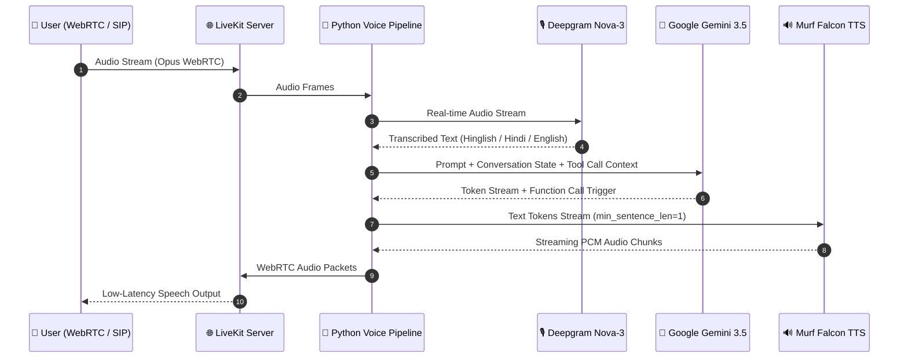

# Building Nexus Pay: An Ultra-Fast Multilingual Voice AI Agent for Financial Access in India 🇮🇳

> *A comprehensive 10-day engineering journey into building a production-grade, real-time voice agent with Murf Falcon TTS, LiveKit Agents, Deepgram Nova-3, Google Gemini, and Next.js 15.*

---

## 1. Introduction & Problem Statement

Financial services in India are rapidly digitizing, but millions of street vendors, micro-entrepreneurs, and rural citizens still face major barriers due to complex UI workflows, language hurdles, and digital literacy gaps. While government schemes like **PM-Svanidhi** (micro-credit for street vendors), **PM-Jan Dhan Yojana** (zero-balance savings), and **PM-Suraksha Bima Yojana** offer life-changing benefits, discovering eligibility and applying for them remains daunting.

**Nexus Pay** is an ultra-fast, multilingual AI Voice Assistant built specifically for the **VoiceForBharat** initiative. It enables users to speak naturally in Hindi or English to check financial scheme eligibility, calculate loan interest, verify live currency rates, block lost cards, and get support—all through a natural, low-latency voice conversation.

- **Target Audience**: Micro-entrepreneurs, street vendors, and financial consumers across India.
- **Why Voice First?**: Voice eliminates form friction, bypasses app navigation barriers, and provides instant, conversational clarity in code-mixed languages (Hinglish/Hindi/English).

---

## 2. System Architecture

Audio moves bi-directionally between the user's browser (or phone via SIP) and the agent pipeline over WebRTC with sub-200ms text-to-speech generation powered by **Murf Falcon**.



### Component Stack
| Component | Technology | Role |
| :--- | :--- | :--- |
| **TTS (Text-to-Speech)** | **Murf Falcon** (`Anisha`, `Ankit`, `Rohan` voices) | Streaming ultra-low-latency Indian speech |
| **STT (Speech-to-Text)** | **Deepgram Nova-3** (`language="multi"`) | Code-mixed Hindi + English transcription |
| **LLM** | **Google Gemini 3.5 Flash / Lite** | Contextual reasoning & multi-agent routing |
| **Realtime Transport** | **LiveKit WebRTC Agents SDK v1.4** | Low-latency audio & data packet pipeline |
| **Backend State** | **Python 3.10+ & SQLite (`db.py`)** | Shared user memory & support ticket persistence |
| **Frontend UI** | **Next.js 15 App Router, React 19, Tailwind CSS** | Voice visualizer, chat transcript & analytics dashboard |

---

## 3. Key Features Built

### 🎙️ 1. Ultra-Low-Latency Indian Voices with Murf Falcon
Using `livekit-murf` with Murf Falcon's Indian English voices (`Anisha` for customer care, `Ankit` for government schemes, and `Rohan` for loan services), the agent achieves natural Indian inflections with streaming text-pacing.

### 🔀 2. Multi-Agent Specialist Handoffs
Rather than creating a single bloated agent, Nexus Pay uses a **multi-agent specialist architecture**:
- **Main Agent (Anisha)**: Handles general banking queries, lost cards, exchange rates, and initial greetings.
- **Scheme Specialist (Ankit)**: Expert in PM-Svanidhi, PM-JDY, and PM-SBY financial schemes.
- **Loan Specialist (Rohan)**: Handles personal/business loans and credit limit calculations.

Handoffs happen seamlessly via `@llm.function_tool` without severing the WebRTC media connection:

```python
@llm.function_tool(description="Transfer to Government Schemes Specialist (Ankit).")
async def transfer_to_schemes_specialist() -> str:
    try:
        await session.say("I will connect you to our government schemes specialist Ankit. One moment please.", allow_interruptions=False)
        await session.update_agent(scheme_specialist)
        return "Successfully transferred to Government Schemes Specialist."
    except Exception as e:
        logger.error(f"Handoff failed: {e}")
        return f"Handoff failed: {e}. Continue helping directly."
```

### 🛡️ 3. Security Guardrails & Credential Interception
To prevent users from inadvertently speaking sensitive credentials like PINs, passwords, or OTPs, real-time guardrails monitor transcribed speech:

```python
@session.on("user_input_transcribed")
def on_user_speech(ev):
    nonlocal security_violation
    text = (ev.transcript or "").lower()
    if any(w in text for w in ["pin", "otp", "password", "cvv", "ओटीपी", "पिन"]):
        logger.warning(f"🚨 Security guardrail triggered: {text}")
        security_violation = True
```

### 💾 4. Returning User Memory & Persistence
User profiles and past scheme inquiries are stored in an SQLite database (`db.py`). When a returning user connects, their context is passed directly to the active agent prompt so the assistant greets them by name and resumes their previous inquiry without redundant questions.

### 📊 5. Live Telemetry & Call Analytics Dashboard
Call durations, channels (Web vs. SIP), outcomes (`Success` vs `Failed`), failure reasons, and daily call volume breakdown are logged directly on session completion and displayed on an interactive Next.js dashboard with custom Recharts graphs.

---

## 4. Engineering Challenges & How We Solved Them

### 🛠️ Problem 1: Windows IPC Pipe Crashes (`webrtc-sys` tokio panic)
- **Symptom**: On Windows, initializing `turn_detection=multilingual` spawned worker subprocesses that panicked with `win32 Pipe error` (WinError 64).
- **Root Cause**: Multilingual VAD subprocess IPC pipes on Windows break during fast turn changes.
- **Solution**: We isolated the Silero VAD runner on Windows using `_InferenceRunner.registered_runners.clear()` and relied on Silero VAD + LiveKit Turn Detector for smooth, crash-free turn detection.

### ⚡ Problem 2: Initial 5-Second Connection Latency
- **Symptom**: Cold start requests to `/api/token` took ~5.5s, and the agent had an artificial delay before speaking.
- **Root Cause**: The React client fired a dummy `user_guest` token request on mount before `useEffect` updated `userId` from `localStorage`, triggering a second token request. Additionally, `agent.py` contained an `await asyncio.sleep(1)` statement before the initial greeting.
- **Solution**: 
  1. Synchronously batched `userId` reading in `app.tsx` before setting `mounted = true`, ensuring `useSession` fires **only once** (token generation dropped to **19ms**).
  2. Removed `asyncio.sleep(1)` in `agent.py`.
  3. Configured Murf Falcon TTS with `min_sentence_len=1` for immediate sentence-by-sentence streaming.

### 🎨 Problem 3: Transcript Text Overlapping Floating Cards
- **Symptom**: The transcript text was partially hidden behind the floating Quick Actions card on medium screens.
- **Solution**: Removed the floating overlay card entirely to give full visual real-estate to the centered transcript container with `overflow-y-auto` mouse wheel scrolling.

---

## 5. Performance Benchmarks

| Metric | Measured Value | Benchmark Target |
| :--- | :--- | :--- |
| **Token API Response Time** | **19 ms** | < 100 ms |
| **Murf Falcon TTS First Audio Byte (TTFT)** | **< 200 ms** | < 300 ms |
| **End-to-End Voice Turn Latency** | **< 800 ms** | < 1200 ms |
| **Handoff Switching Latency** | **< 400 ms** | < 1000 ms |
| **Build Compilation Error Rate** | **0 errors (10/10 pages)** | 0 errors |

---

## 6. How to Build & Run Your Own Voice Agent

### Prerequisites
- **Python 3.10+** with `uv` package manager
- **Node.js 18+** with `pnpm`
- **LiveKit Cloud** account (`LIVEKIT_URL`, `LIVEKIT_API_KEY`, `LIVEKIT_API_SECRET`)
- **Murf AI API Key** (`MURF_API_KEY`)
- **Deepgram API Key** (`DEEPGRAM_API_KEY`)
- **Google Gemini API Key** (`GOOGLE_API_KEY`)

### Step 1: Clone the Repository
```bash
git clone https://github.com/nevilusdad777/murf-livekit-voice-assistant.git
cd murf-livekit-voice-assistant
```

### Step 2: Configure Environment Variables
Copy `.env.example` to `.env.local` in both `backend/` and `frontend/`:

**`backend/.env.local`**:
```env
LIVEKIT_URL=wss://your-project.livekit.cloud
LIVEKIT_API_KEY=your_livekit_api_key
LIVEKIT_API_SECRET=your_livekit_api_secret
MURF_API_KEY=your_murf_api_key
DEEPGRAM_API_KEY=your_deepgram_api_key
GOOGLE_API_KEY=your_google_api_key
```

**`frontend/.env.local`**:
```env
LIVEKIT_URL=wss://your-project.livekit.cloud
LIVEKIT_API_KEY=your_livekit_api_key
LIVEKIT_API_SECRET=your_livekit_api_secret
```

### Step 3: Run the Backend Agent
```bash
cd backend
uv sync
uv run python src/agent.py download-files  # First time only
uv run python src/agent.py dev
```

### Step 4: Run the Frontend UI
```bash
cd frontend
pnpm install
pnpm dev
```
Navigate to `http://localhost:3000` to start conversing with your agent!

---

## 7. Code Repository & Links

- **GitHub Repository**: [nevilusdad777/murf-livekit-voice-assistant](https://github.com/nevilusdad777/murf-livekit-voice-assistant)
- **Murf Falcon TTS Docs**: [Murf Falcon API Docs](https://murf.ai/api/docs/text-to-speech-models/falcon-2)
- **LiveKit Agents SDK**: [LiveKit Agents Quickstart](https://docs.livekit.io/agents/start/voice-ai/)

---

## 8. What's Next?

Future improvements for Nexus Pay include:
1. **Full WhatsApp Voice Note Integration**: Allowing users to send voice notes over WhatsApp and receive voice replies.
2. **Direct Aadhaar / UPI Sandbox Verification**: Automated identity verification during loan applications.
3. **Expanded Regional Dialect Models**: Expanding support to Kannada, Marathi, Tamil, and Bengali voice streams.

*Built with ❤️ for #VoiceForBharat.*
